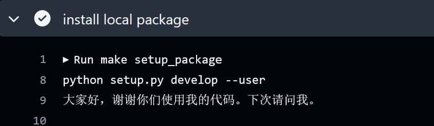
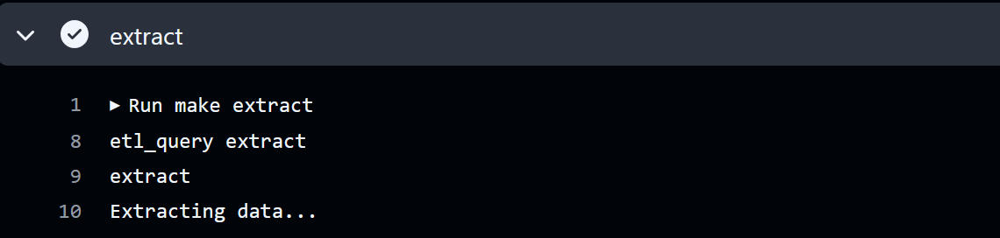
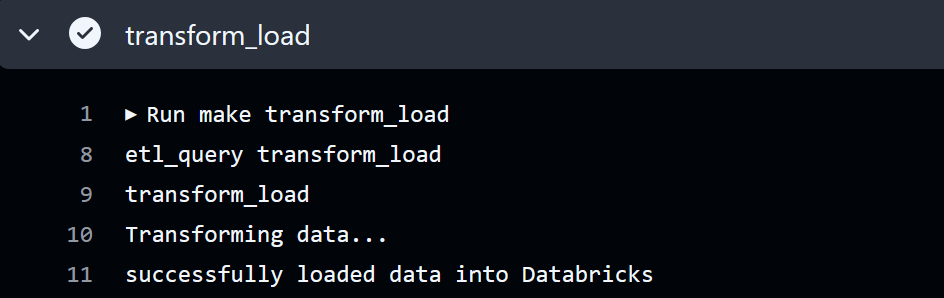
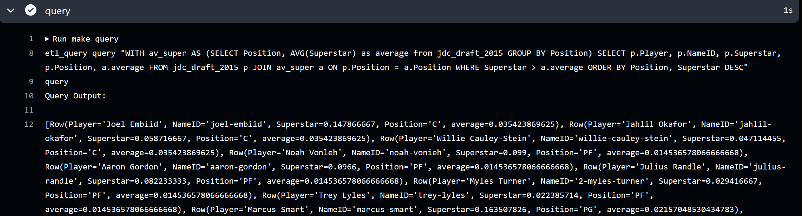

# ETL-Query Script User Guide

## Overview

The ETL-Query script is a command line interface (CLI) tool that performs Extract, Transform, and Load (ETL) operations and also executes queries. Read this guide for instructions on how to set up and use the script.

## Set up 
To access the CLI tool, you need to run setup.py by typing:

```bash
python setup.py develop
```
Note: This should also be possible when running `make setup_package` 


Now we can run the project as an executable with `etl_query`

## Usage

### Running the Script

To run the ETL-Query script, use the following command:

```bash
etl_query <action> 
```

### Actions

The script supports the following actions:

- `extract`: Extract data
- `transform_load`: Transform and load data
- `query`: Execute a query

## Examples

### Extract Data

```bash
etl_query extract
```



This command will extract data.

### Transform and Load Data

```bash
etl_query transform_load
```


This command will transform and load data.

### Execute General Query

```bash
etl_query query <query>
```

Replace `<query>` with the specific query you want to execute.



## Notes

- Ensure that you have the required dependencies installed before running the script, this can be done with `make install`.
- All of these actions can also be done running:
* `make extract`
* `make transform_load` 
* `make query` - though this has a query already input, so to run your own query, `etl_query query <query>` is recommended. 